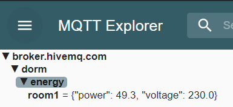

# ESP32 IoT Projects

Learning embedded systems and IoT development as part of my 
Digital Technology & Management degree at OTH Amberg-Weiden.

## Projects
- **LED Blink** - First MicroPython program, controls onboard LED
- **WiFi Connect** - ESP32 connecting to network, printing IP address
-**Weather Data Fetch** - HTTP GET request to Open-Meteo API, parsing JSON response to extract live weather data for Amberg
**MQTT Publisher** - Publishes simulated energy data (watts, voltage) 
  to HiveMQ broker every 5 seconds using JSON payloads. 
  Foundation for the smart energy tracker project.

## Tech Stack
MicroPython · ESP32 · IoT

## In Progress
Smart energy monitor using PZEM-004T sensor and MQTT
